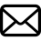
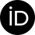
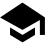
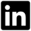

# Kyle N. Rossi
#####Research Assistant at Kent State University
#####(he/him)

    

## About Me

I am a doctoral student and research assistant at Kent State University. Currently, I am pursuing a Ph.D. while working on the srcML infrastructure. My primary interests are in software engineering and programming language parsing, although I am working on Pythonic idiom analysis.

## srcML

**srcML** (Source Markup Language) is an XML representation for source code that preserves all original content. It is lightweight, scalable, and supports various programming languages (e.g., C, C++, C#, Java, and Python). Notably, srcML has its own built-in query language (`srcQL`) and is the foundation for many tools (e.g., `stereocode`, `nameCollector`, etc.).

Example file `example.py`:

    # Adds two numbers, x and y
    
    def sum(x, y):
        return x + y

srcML output for `example.py`:

    <?xml version="1.0" encoding="UTF-8" standalone="yes"?>
    <unit xmlns="http://www.srcML.org/srcML/src" revision="1.0.0" language="Python" filename="example.py">
    <comment type="line"># Adds two numbers, x and y</comment>

    <function>def <name>sum</name><parameter_list>(<parameter><name>x</name></parameter>, <parameter><name>y</name></parameter>)</parameter_list><block>:<block_content>
        <return>return <expr><name>x</name> <operator>+</operator> <name>y</name></expr></return>
    </block_content></block></function></unit>

I have primarily contributed to srcML by modifying the existing infrastructure to support the addition of new programming languages (e.g., Python). I am also involved with writing programming language grammars (in XML format) and bug fixing. Using srcML, I have extended existing Pythonic idiom detection.

## Education

**Ph.D. in Computer Science**

* *Kent State University*
* August 2025 - Present

**M.S. in Computer Science**

* *The University of Akron*
* August 2023 - July 2025
* Thesis Title: "Extending srcML to Python to Analyze Pythonic Idioms"

**B.S. in Computer Science**

* *The College of Wooster*
* August 2019 - May 2023
* Independent Study Title: "Visualizing Constraint Satisfaction Problems Using Swarm Intelligence"

## Publications

* K. N. Rossi, "Extending srcML to Python to Analyze Pythonic Idioms," University of Akron, 2025. \[Online\]. Available: [http://rave.ohiolink.edu/etdc/view?acc_num=akron1750947582590048](http://rave.ohiolink.edu/etdc/view?acc_num=akron1750947582590048)
* K. N. Rossi, "Visualizing Constraint Satisfaction Problems Using Swarm Intelligence," The College of Wooster, 2023. \[Online\]. Available: [https://openworks.wooster.edu/independentstudy/10550](https://openworks.wooster.edu/independentstudy/10550)

## Professional Activities

* ICPC 2026 - Additional Reviewer
* ICSME 2025 - Additional Reviewer
* FSE 2025 - Additional Reviewer
* VISSOFT 2024 - Additional Reviewer
* FSE 2024 - Additional Reviewer
